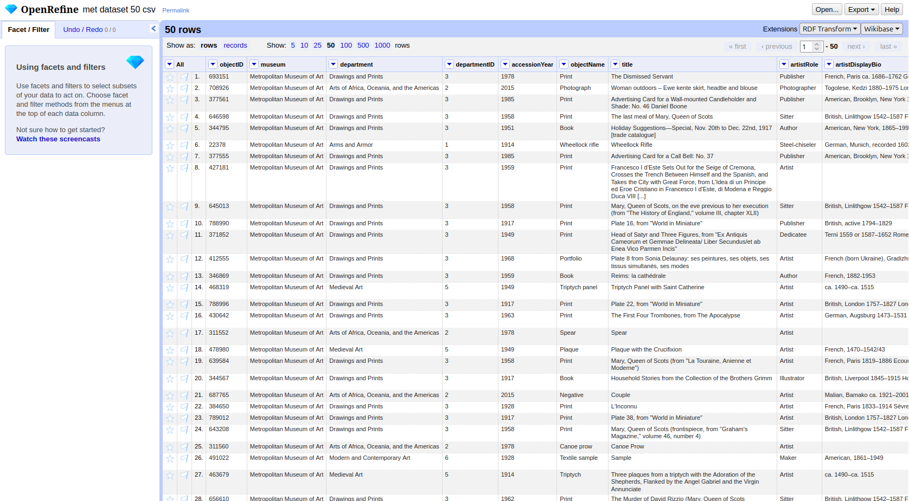

:::::::::::::::::::::::::::::::::::::: questions 

- Why use a tool like OpenRefine instead of writing RDF manually?
- How can a CSV table be transformed into RDF?
- What is reconciliation?

::::::::::::::::::::::::::::::::::::::::::::::::

::::::::::::::::::::::::::::::::::::: objectives

- Load a CSV dataset into OpenRefine and navigate its interface.
- Explain how tabular data maps to RDF entities and properties.
- Define a root node for the Person entity and attach properties to it.
- Complete the remaining entities and connect them into a graph.
- Reconcile text values against Wikidata and ULAN to replace them with IRIs.

::::::::::::::::::::::::::::::::::::::::::::::::

So far, we have learnt how to model knowledge using the subject-predicate-object model, how to identify resources with IRIs, how to write RDF in N-Triples and Turtle, and how to use vocabularies to give our data shared meaning. In this chapter, we put all of that together.

Writing RDF by hand works well for a handful of triples, but becomes impractical quickly. A dataset with hundreds or thousands of rows would require thousands of triples, each with full IRIs for subject, predicate, and object. This is where tools come in.

## What Is OpenRefine?

**OpenRefine** is a free, open-source tool for working with tabular data. It runs in the browser but operates locally on your computer, your data never leaves your machine. Originally developed to clean and transform messy datasets, OpenRefine has grown into a general-purpose tool for data exploration and enrichment. If you are interested, there is a Carpentries Lecture "[OpenRefine for the Humanities](https://hermes-dkz.github.io/OpenRefine-humanities/)" you can go through to get a deeper insight of the tool.

The feature we want to look at is the **RDF-Transform** extension, which adds the ability to map a spreadsheet to RDF. Instead of writing triples by hand, we define the mapping once: which columns become subjects, which become predicates, which become objects and OpenRefine applies it to every row automatically.

Make sure OpenRefine is installed and the RDF-Transform extension is set up. You can find instructions in the setup page for this lesson.

### Getting to Know the Interface

Open OpenRefine in your browser. You will see the **start screen**, which lets you create a new project by importing a file.

**Loading the dataset:**

1. Click *Create Project* → *This Computer* and select the file `met-dataset-50.csv` and click *Next*.
2. OpenRefine previews the data. Here you can configure more detailed import settings if necessary. In our case everything should be set up correctly.
3. Click *Create Project*.

You should now see the dataset as a table: 50 rows, one per museum object.

The interface has a few key areas worth knowing:

- **Column headers** each have a small dropdown arrow. Clicking it opens a menu with options to transform, filter, or rename that column.
- **Facets and filters** (left panel) allow you to explore and narrow down the data.
- **Undo / Redo** (top left) keeps a full history of all changes you make. You can step backwards at any point.
- **RDF Transform** button in the top menu bar opens the extension panel where we will define the entire mapping.

