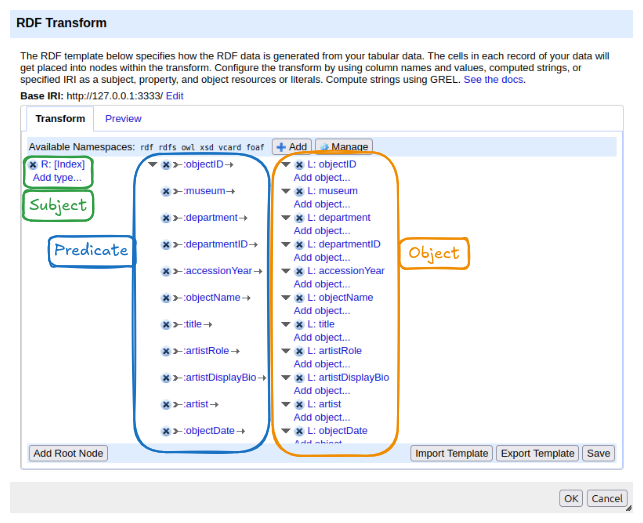
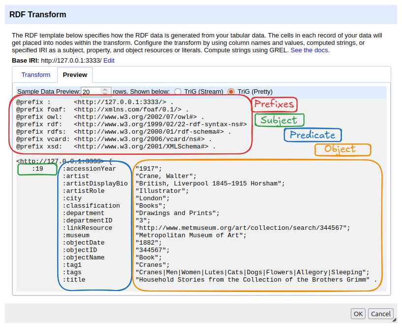

:::::::::::::::::::::::::::::::::::::: questions 

- Why use a tool like OpenRefine instead of writing RDF manually?
- How can a CSV table be transformed into RDF?
- What is reconciliation?

::::::::::::::::::::::::::::::::::::::::::::::::

::::::::::::::::::::::::::::::::::::: objectives

- Load a CSV dataset into OpenRefine and navigate its interface.
- Implement the data model from the previous chapter using RDF-Transform.
- Define a root node for the Person entity and attach properties to it.
- Complete the Object entity and connect it to the Person.
- Reconcile text values against Wikidata and ULAN to replace them with IRIs.

::::::::::::::::::::::::::::::::::::::::::::::::

In the previous chapter, we designed a data model for our Met dataset: we identified the entities, chose classes and properties from shared vocabularies, and planned how the columns of the table map to RDF triples. We know *what* we want to produce. Now we need a way to actually produce it.

Writing RDF by hand works well for a handful of triples, but becomes impractical quickly. A dataset with 50 rows and multiple properties per entity would require hundreds of triples, each written out in full. The tool we will use to automate this is **OpenRefine** with the **RDF-Transform** extension.

## What Is OpenRefine?

**OpenRefine** is a free, open-source tool for working with tabular data. It runs in the browser but operates locally on your computer, your data never leaves your machine. Originally developed to clean and transform messy datasets, OpenRefine has grown into a general-purpose tool for data exploration and enrichment. If you are interested, there is a Carpentries Lecture "[OpenRefine for the Humanities](https://hermes-dkz.github.io/OpenRefine-humanities/)" you can go through to get a deeper insight of the tool.

The feature we want to look at is the **RDF-Transform** extension, which adds the ability to map a spreadsheet to RDF. Instead of writing triples by hand, we define the mapping once: which columns become subjects, which become predicates, which become objects and OpenRefine applies it to every row automatically.

Make sure OpenRefine is installed and the RDF-Transform extension is set up. You can find instructions in the setup page for this lesson.

Open OpenRefine in your browser. You will see the **start screen**, which lets you create a new project by importing a file.

**Loading the dataset:**

1. Click *Create Project* → *This Computer* and select the file `met-dataset-50.csv` and click *Next*.
2. OpenRefine previews the data. Here you can configure more detailed import settings if necessary. In our case everything should be set up correctly.
3. Click *Create Project*.

You should now see the dataset as a table: 50 rows, one per museum object.

The interface has a few key areas worth knowing:

- **Column headers** each have a small dropdown arrow. Clicking it opens a menu with options to transform, filter, or rename that column.
- **Facets and filters** (left panel) allow you to explore and narrow down the data.
- **Undo / Redo** (top left) keeps a full history of all changes you make. You can step backwards at any point.
- **RDF Transform** button in the top menu bar opens the extension panel where we will define the entire mapping.

## What is RDF-Transform

RDF-Transform is an extension for OpenRefine that provides a visual interface for defining how tabular data becomes RDF. You describe the mapping once, which columns represent which entities, which properties they have, and how they connect and the extension generates the RDF output for every row automatically.

To open it, click **RDF Transform** in the top menu bar of an open project, then select *Edit RDF Transform...*. This opens the mapping panel.

The panel has two tabs:

- **Transform**: where the mapping is configured. This is where you will spend most of your time.
- **Preview**: shows a sample of the RDF output based on the current mapping, updated live as you make changes.

At the top of the Transform tab you will find:

- **Base IRI**: the default namespace used when constructing IRIs from column values. It can be changed to match your project.
- **Available Namespaces**: the prefixes declared for use in the mapping. Several common ones (rdf, rdfs, owl, xsd, vcard, foaf) are pre-loaded. New namespaces can be added with the *+ Add* button and managed with *Manage*.

The main area shows the **mapping structure**. When you first open RDF-Transform on a dataset, it automatically generates a starting point: it reads all column names and creates one property per column, using the column name as the predicate. This auto-generated mapping is a useful overview of what data is available, but it is not yet meaningful RDF, it uses made-up property names and treats everything as a literal. We will replace it with our own mapping.

The structure of the mapping follows the triple model you already know:

- On the left: a **root node** — this becomes the subject of the triples. The default root node uses the row index as the subject.
- In the middle: **properties** — these become the predicates.
- On the right: **objects** — literal values from columns, or links to other root nodes.

At the bottom of the panel, the **Add Root Node** button lets you add a new entity type to the mapping. The **Import Template** and **Export Template** buttons allow you to save and reuse a mapping across projects. **Save** applies the current mapping to the project.

To get a first impression of what the data looks like as RDF, switch to the *Preview* tab. It shows the current mapping rendered as Turtle. At the top you will see the declared namespaces, followed by the generated triples. In the auto-generated mapping, each row's index becomes the subject, and each column header becomes a predicate with the corresponding cell value as a literal object.

