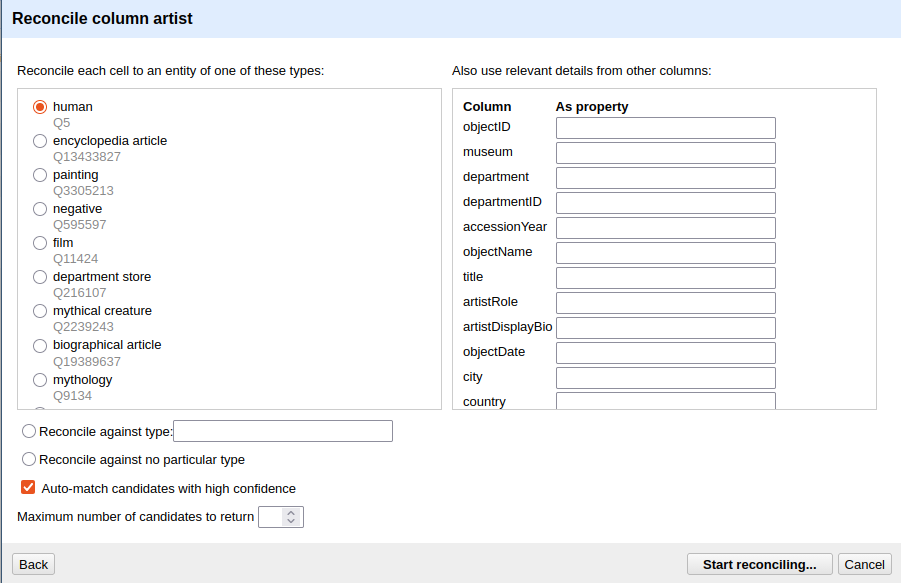

:::::::::::::::::::::::::::::::::::::: questions 

- What is reconciliation and why does it matter for Linked Data?
- How do I reconcile a column against Wikidata in OpenRefine?
- How do I use reconciled values to add authority IRIs to my RDF mapping?

::::::::::::::::::::::::::::::::::::::::::::::::

::::::::::::::::::::::::::::::::::::: objectives

- Explain what reconciliation is and why it is a key step in creating Linked Open Data.
- Reconcile the `artist` column against Wikidata in OpenRefine.
- Review, accept, and reject candidate matches.
- Add `schema:sameAs` links to the Person entity using the reconciled Wikidata IRIs.

::::::::::::::::::::::::::::::::::::::::::::::::


## From Placeholders to Real Identifiers

In the previous chapter, we created a Person entity for each artist in our dataset. The subject IRI was constructed from the artist's name — `http://example.org/person/Surugue%2C+Louis`. This works within our dataset: the IRI is unique, consistent across rows, and stable enough for the mapping to function.

But it is still a local placeholder. Nothing outside our dataset knows what `http://example.org/person/Surugue%2C+Louis` refers to. It cannot be connected to information about this artist in other datasets, and a system working with Wikidata or any other authority file has no way to recognise it as the same person.

This is the gap between a local RDF dataset and genuine **Linked Open Data**. To close it, we need to connect our local entities to identifiers that the wider LOD ecosystem already knows: identifiers in authority files like Wikidata, ULAN, or the GND.

The process of establishing these connections is called **reconciliation**.


### What Is Reconciliation?

Reconciliation means matching the values in a column against the entities in an external authority file and finding the best correspondence for each value.

In practice: you take the text "Surugue, Louis" and ask Wikidata: *is there an entity in your system that matches this name?* Wikidata returns one or more candidates with confidence scores. You review them, confirm the correct match, and the local text value is now linked to a globally recognised IRI: `https://www.wikidata.org/wiki/Q5981497`.

This is not about replacing your local data. The local placeholder IRI remains the subject of your RDF graph. What reconciliation adds is a link to the same entity in another dataset. Any system following that link can retrieve everything the other dataset, in our example Wikidata, knows about the person without you having to include it yourself.

:::::::::::::::::::::::::::::::::::::: callout

### Why Authority Files?

An **authority file** is a curated, maintained list of entities — persons, places, organisations, concepts — each with a stable identifier and a canonical form of the name. Authority files are maintained by libraries, archives, research institutions, or other communities. They exist precisely to solve the problem of ambiguous or inconsistent names.

Wikidata is the largest openly accessible authority file and covers an enormous range of entities. **ULAN** (Union List of Artist Names, Getty Research Institute) is a domain-specific authority for artists and architects. Both are widely used in the cultural heritage sector.

When you reconcile against these sources, your data gains a connection to a global knowledge network and any other dataset that has reconciled against the same source is now implicitly connected to yours.

::::::::::::::::::::::::::::::::::::::::::::::::::


## Reconciling Against Wikidata

OpenRefine has a built-in reconciliation client that can query any reconciliation service endpoint. Wikidata provides one out of the box.

**Start the reconciliation:**

1. Click the dropdown arrow on the `artist` column header in Open Refine, not the RDF-Transform window.
2. Select *Reconcile* → *Start reconciling...*.
3. In the dialog that opens, select **Wikidata (en)** from the list of available services and click **Next**.
4. Under *Reconcile each cell to an entity of type*, type `human` and select the result *human (Q5)*. This tells Wikidata that you are looking for people, which narrows the search and improves match quality.
5. Click *Start reconciling*.

OpenRefine will now query Wikidata for every unique value in the `artist` column. Depending on the number of distinct values and network speed, this may take a moment.




### Reviewing Matches

In some cases, Open Refine will be certain that it has selected the correct entity, while in others it will not. In cases where it is certain, the name is displayed directly in blue as a link that takes you to the entry in Wikidata.
In other cases, various entities are displayed from which you must choose. In our case, for example, in row 8. There, OpenRefine is unsure, and we must explicitly confirm once again whether the entity found is the correct one. If we look at the Wikidata entry, we can see that the person listed there was active in Modena, a city that is also found in our data. That is enough for us to be certain in this case. Now we can click the single tick (✓) to confirm the entity or the double tick (✓✓) to perform this action for all fields associated with this entity. In row 10, with Rudolph Ackermann, it gets more difficult. There, we have two people to choose from, and since we have little other information in our dataset, it is difficult to be certain which entity is the correct one. If no candidate is correct, you can leave the cell unmatched, search for a match by hand or even create a new Entity in wikidata. 

:::::::::::::::::::::::::::::::::::::: callout

### Not every match will succeed

For well-known artists — Rembrandt, Dürer, Hokusai — Wikidata will typically return a confident single match. For lesser-known, historical, or ambiguously named artists, the match may be uncertain or absent. This is expected. Reconciliation improves data quality where it can; it does not require perfection to be useful. Even a partial reconciliation, covering 60 % of artists, significantly increases the connectedness of the dataset. However, reconciliation always requires expertise and domain knowledge. In our example, it is already clear that some decisions cannot be made without further research.

::::::::::::::::::::::::::::::::::::::::::::::::::


As mentioned earlier, we have only created a link within Open Refine so far. If we want to supplement the underlying data with the new information, we need to add a new column containing that information:

1. Click the droptdown arrow in the `artist` column again
2. **Reconcile** -> **Add column with URLs of matched entities**
3. Enter **artistSameAs** as column name

Now you can see a new column in your data linking the artist to the corresponding Wikidata entity.


## Applying Reconciled IRIs in RDF-Transform

Confirming a match in OpenRefine does not automatically change the exported RDF, we still need to tell RDF-Transform to use the reconciled Wikidata IRI. We do this by adding a `schema:sameAs` property to the Person root node.

1. Open the RDF-Transform panel (*RDF Transform* → *Edit RDF Transform...*).
2. Find the Person root node.
3. Add a new property: `schema:sameAs`.
4. Add a new object to this property.
5. Set the Content to our new **artistSameAs** column
4. Sett **Content used... to IRI.

RDF-Transform will now read the reconciled Wikidata IRI for each cell and write it as the value of `schema:sameAs`. Cells that were not reconciled will produce no triple for this property.

Switch to the *Preview* tab to check the result. A successfully reconciled artist should now appear like this:

```turtle
<example.de/Surugue,Louis>
        rdf:type            schema:Person;
        rdfs:label          "Surugue, Louis";
        schema:description  "French, Paris ca. 1686–1762 Grand Vaux";
        schema:sameAs       <https://www.wikidata.org/wiki/Q5981497> .
```

The local IRI remains the subject. The `schema:sameAs` link connects it to the Wikidata entity. Both are now part of the triple, and any system following the `schema:sameAs` link can retrieve the full Wikidata record for this person.


