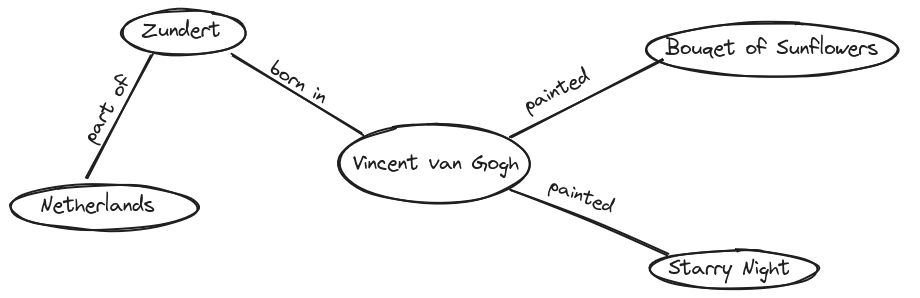

:::::::::::::::::::::::::::::::::::::: questions 

- What is Linked Open Data, and how does it differ from other data models?
- Why are standardized identifiers (e.g., URIs) essential for LOD?
- How can the subject-predicate-object model be used to describe LOD?
- What are real-world examples of Linked Open Data in the humanities?

::::::::::::::::::::::::::::::::::::::::::::::::

::::::::::::::::::::::::::::::::::::: objectives

- Explain the concept of Linked Open Data (LOD) in your own words.
- Distinguish between "Linked Data" and "Linked Open Data" using an example.
- Describe the importance of standardized identifiers (e.g., URIs) for linking data.
- Represent simple Linked Open Data relationships using the subject-predicate-object model.

::::::::::::::::::::::::::::::::::::::::::::::::

## Introduction

In this lesson, we want to explore the fundamentals of **Linked Open Data (LOD)**. What is it, and why is it important? To answer these questions, we will break the term down step by step. The first and most fundamental concept we need to understand is: **What type of data are we dealing with? In what form does data exist when we talk about LOD?**  To do this, first we want to look at the terms *linked*, *open*, and *data*, to understand what we are talking about in the first place.

:::::::::::::::::::::::::::::::::::::: discussion

### What is data?

When we talk about data, many people often understand different things about it, and no-one can quite put their finger on what it actually means. Try to approach this term on a linguistic level and find out what it could mean. 

::::::::::::::::::::::::::::::::::::::::::::::::::

It is not quite easy to find a universal definition to this, but most of the time data is described as something from the real world, which was observed and then written down. In the humanities this could be a **letter** or an **archaeological object** . In other fields of research, data is often a measurement result or observation. What they have in common is that they try to depict a part of the real world. In our digital age, hopefully, these data is digitalised and this digitalisation leads to challenges. It is impossible to map the entire section of the real world, which means that people with domain knowledge have to decide what to capture and what not. This is always application-related and individual. 

Now that we understand what data is, we want to look at how it can be captured and digitised, which is why we will look at the L from LOD next.


:::::::::::::::::::::::::::::::::::::: discussion

### What requirements should data fulfil?

::::::::::::::::::::::::::::::::::::::::::::::::::

:::::::::::::::::::::::::::::::::::::: discussion

### What data modelling options do you know?

::::::::::::::::::::::::::::::::::::::::::::::::::


Imagine you are a researcher studying **Vincent van Gogh** and want to build a collection of information about him. You could gather details about his paintings, his friends, the places he visited, and much more. Probably the most common way would be to store this information in a table. This has various advantages, but also disadvantages. As with the collection of data and writing it down, there is no clear answer as to which type of modelling is correct, it remains individual and above all depends on the project. If you want to combine your own data with other data, such as information about Van Gogh's home town or his circle of acquaintances, it becomes difficult to visualise this in a table. The question is now, how we structure our knowledge in a way, that is easy to share, connect, and expand?  


## Structuring Knowledge: The Subject-Predicate-Object Model  

Given the following Information about **Vincent Van Gogh**: He was **born** in **Zundert** and has **drawn** the painting **Starry Night**

One way to structure and link knowledge is to break it down into **simple relationships** using the **subject-predicate-object** model. This model is a fundamental method for structured data representation:  


:::::::::::::::::::::::::::::::::::::: callout

### The subject-predicate-object model

**Subject**: The entity being described.  

**Predicate**: The relationship or attribute.  

**Object**: The value or linked entity. 

::::::::::::::::::::::::::::::::::::::::::::::::::


For example, if we want to express that Vincent van Gogh painted *Starry Night*, we can structure it like this:  

### Example Triple for Van Gogh's Painting  


| Subject                 | Predicate      | Object             |
| ----------------------- | -------------- | ------------------ |
| *Bouquet of Sunflowers* | was painted by | *Vincent van Gogh* |


By structuring information in this way, we ensure that the knowledge we store—namely, that Vincent van Gogh painted this artwork—is precise and easy to understand. We reduce the sentence to the essential elements, making it easier to store and process.  

Now, if we wanted to store additional paintings by Vincent van Gogh, we could use the same format. Adding another painting to the table would look like this:  


| Subject                 | Predicate      | Object             |
| ----------------------- | -------------- | ------------------ |
| *Bouquet of Sunflowers* | was painted by | *Vincent van Gogh* |
| *Starry Night*          | was painted by | *Vincent van Gogh* |


However, at this point, our data is still in a tabular format, which is not the format used in LOD.  


## Triples Visualized

To visualize how Linked Open Data works, imagine a **mind map**. Write *Vincent van Gogh* in the center of a page and draw lines to various related terms:  

- One line connects *Bouquet of Sunflowers* with the label **was painted by**.  

- Another line connects *Zundert* (his birthplace) with the label **was born in**.  

- A third line connects *Zundert* with *Netherlands* with the label **is part of**.  

Each of these connections expands the **knowledge network**—a simple version of what we call the **LOD cloud**. The more connections we create, the richer and more meaningful our dataset becomes. The resulting mind map would look like this:  





By visualizing the data, it becomes easier to see why this way of storing and structuring knowledge is so efficient and valuable. Imagine a much larger mind map with significantly more information. This could reveal connections between people that were previously invisible. Furthermore, if researchers from different locations collaborate on such a mind map, additional insights and knowledge can be discovered. In very theorital and ideal scenario it would be possible to draw a mindmap with every information in the world to find a connection from you to Bill Gates.

:::::::::::::::::::::::::::::::::::::: challenge  

## Create a Graph  

Go into breakout rooms and create a graph with [Excalidraw](https://excalidraw.com/). Try to find connections you could model in that graph.  
Possible properties could be:  

- born in  
- studied in  
- lives in  

Feel free to get creative and think about what other information could be modeled in this way, then create your own graph.  


:::::::::::::::: solution


```
TODO
Valid turtle.
```

:::::::::::::::::::::::::

::::::::::::::::::::::::::::::::::::::::::::::::::  


